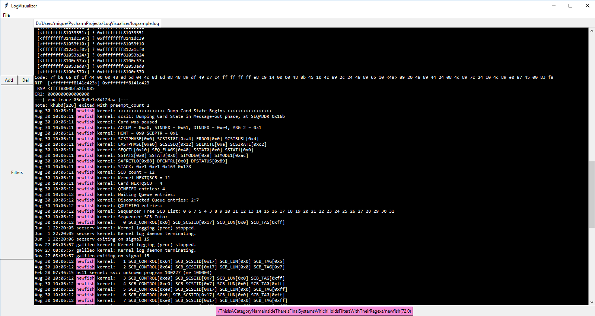

# LogVisualizer
A tool to visualize well known logs 



## Requierements:
* paramiko
* scp
* easytkinter

## How to use
#### The logparser.json file 
Modify the _logparser.json_ file according to your necessities.
```json
{
  "jsontype":"logconf",
  "contents":[
    {
      "type":"category",
      "name": "TheNameOfTheCategory",
      "contents": [
          {
            "type": "systems",
            "systems": [
              {
                "name": "ATypeOfMatch",
                "regex": "TheRegexForThatMatch"
              },{
                "name": "AnotherTypeOfMatch",
                "regex": "TheRegexForThisMatch"
              }
            ]  
          }
      ]
    },
    {
      "type": "category",
      "name": "AnotherCategory",
      "contents": [
          {
            "type": "systems",
            "systems": [
              {
                "name": "ATypeOfMatch",
                "regex": "TheRegexForThatMatch"
              },{
                "name": "AnotherTypeOfMatch",
                "regex": "TheRegexForThisMatch"
              }
            ]  
          }
      ]
    }
  ]
}
```
You can group multiple types of matches into a bigger group of matches, called a category, 
in that way you can manage you matches easier. "type" : "category" declares that at that level there is a category,
you can add without problems nested categories. Inside categories there are "systems" that are the final
matches that you look for, errors, warnings, connections in your log, etc.
All this configuration must be under "jsontype":"logconf", this is done to incorporate in the future new kinds of configuration in this file.
For now you can't use metacharacters like \d or \s. 

#### The remote.cnf file
###### Section: [GENERAL]
This section holds the basic information to connect to the machine with the logs.
The attributes are:
* USER: The user to use to connect by ssh.
* PASSWORD: The password associated with the given USER
* IP: The IP of the machine containing the logs. 
(This attribute can be overwritten by the IP given if the specific sections)

###### Specific sections [CUSTOMNAME]
You can use the name that you want for this section, no whitspaces allowed, and neither you can call it _GENERAL_
The attributes are:
* ARGS: The arguments sepparated by commas that you will use to retrieve that file. It can be sessions, IP (uppercase), 
etc.
* METHOD: You can choose betwen SCP and SSH. SCP will copy a file and SSH will use the stdout given by the commands you 
choose as the log desired. Depending of which one you use you will need different attributes.

###### _SSH_
This will take the argument _COMMANDS_, put here as a string all the commands you want to retrieve the log you want to 
visualize. For example, supposing you gave **ARGS=IP,PCUSER,SESSION** you can construct a series of commands like
**COMMANDS=cat /home/[PCUSER]/programlogs/[SESSION] | grep kernel**

###### _SCP_
This one will take the argument _REMOTELOCALIZATION_, that contains the remote log, is pretty similar to the 
_SSH_ method. For example supposing **ARGS=IP,PCUSER,SESSION**, one example could be: **REMOTELOCALIZATION=cat /home/[PCUSER]/programlogs/[SESSION]** 

#### Activating filters:
If you wrote without errors the _logparser.json_ file you should be able to open and select the filters you want to use
by clicking in filters the desired filter:

If you want to deactivate a filter just click again on that filter.

#### Navigating through matches:
When you activate a filter a button related to that filter will appear in the bottom of the window:


It shows the categories and subcategories in which the filter is located, separated by "/" and the name of the filter with the number of 
matches in the right part of the button. To navigate through the results just click the button.

## To do:
* Enable metacharacters like \d on regexs